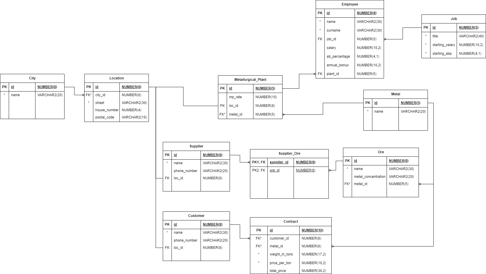

# Metallurgical Enterprise Database

This repository presents a university assignment project that focuses on designing and implementing a comprehensive relational database for a metallurgical enterprise using Oracle SQL.

## Overview

The primary objective of this project was to develop a database that manages various aspects of a metallurgical business.

## Features

The database schema includes several interconnected tables, each representing a key entity within the enterprise:

- **City :** Stores information about the city relevant to the enterprise's operations.
- **Location:** Contains data on specific locations where the enterprise operates.
- **Metallurgical_Plant:** Holds details about the plants involved in metallurgical processing.
- **Customer:** Stores customer information.
- **Employee:** Keeps track of employee details within the organization.
- **Job:** Represents the job of the employee, has data about title, starting salary.
- **Supplier:** Manages data about different ore suppliers.
- **Supplier_Ore:** Table for many to many connection between Suppliers and Ores.
- **Ore:** Contains information on different types of ores processed by the enterprise.
- **Metal:** Manages data regarding the metals produced or utilized.
- **Contract:** Records contractual agreements with customers.

